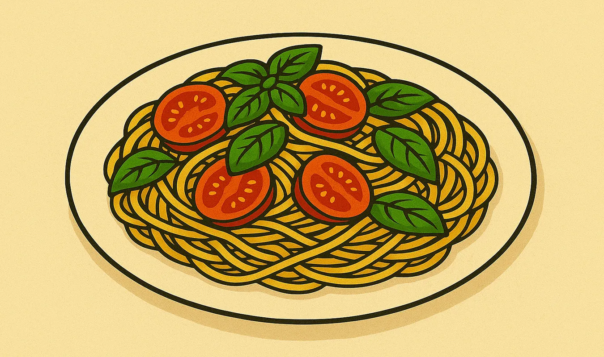
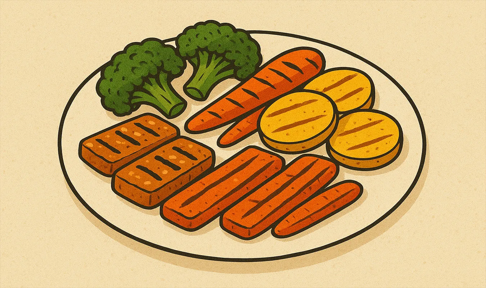
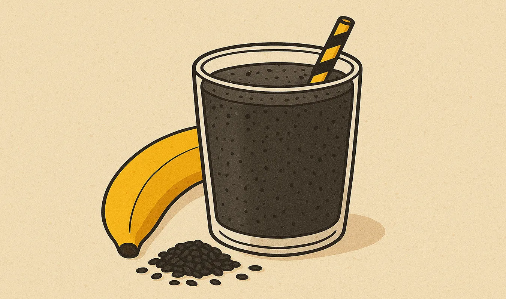
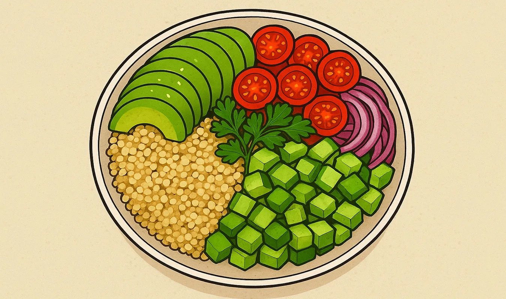

## 序章：静かな回転の始まり―アナログと植物のあいだで

文：mmr｜テーマ：「レコードコレクター」と「ヴィーガン」という二つの立ち位置を手がかりに、文化的・倫理的・感性的な交差点を探る

針を落とすと、空気が震える。  
その一瞬の振動に、私たちは何かを聴き取ろうとする。  
それは──音楽だけではない。思想、感性、選択、記憶。  

レコードを手にし、ヴィーガンという生き方を選ぶ。  
一見、遠い領域にあるようにも思えるこの二つは、  
じつは問いかけるものも、向かう先も、共鳴するものも多い。  

本稿では、「レコードコレクター」と「ヴィーガン」という二つの立ち位置を手がかりに、  
文化的・倫理的・感性的な交差点を探りたい。  
なぜアナログを愛し、なぜ動物性を避けるのか。  
それらは単なる趣味や食の選択を超えて、  
私たちの時間観、存在感、共感のモードを照らす鏡にもなるからだ。

---

---

## 第1章　デジタル飽和とアナログ回帰

### 1.1 デジタルの過剰と「無色」の疲労  
21世紀の時間は、スクリーンによって刻まれている。  
SNS、ストリーミング、通知──光とノイズが絶え間なく流れ込み、  
私たちの感覚は「触れないまま消費する」ことに慣れてしまった。  

その結果、触覚・物質性・ノイズ・隙間──そうしたものが希薄になる。  
だが、かつて「アナログ的経験」が持っていた隙間こそが、  
身体を呼び覚ますスイッチになり得る。  

### 1.2 アナログ回帰という文化的反動  
近年、レコードの再興、フィルム写真、紙の書籍の逆襲……  
それらは、デジタル一極支配への反動として読まれることがある。  
だが、これは単なるノスタルジーではない。  
破れやすい紙、摩耗する針、時間とともに色あせるジャケット──  
それらを愛でる営みは、「痕跡性」と「時間性」を引き受けるものだ。  

アナログ趣味は、即物性と時間の滞留を帯びる。  
そのなかで、レコードは “再生できる記憶” を身体に刻む媒体となる。

### 1.3 コレクションは物語である  
レコードコレクターにとって、盤そのもの以上に語られるものがある。  
誰がプレスしたレーベルか、どの頃に幾度も再発されたか、  
ジャケットのアートワーク、ライナー・ノーツの筆致──  
それら一つひとつに “出来事” が宿る。  

コレクションは、時間のポートレイトであり、  
その延長線上で私たちは自らの記憶や思考の軌跡を重ねる。  

---

## 第2章　ヴィーガンという選択の響き

### 2.1 肉食社会と倫理の裂け目  
多くの人にとって、肉は日常の “当たり前” だ。  
しかしその背後には、家畜の生と死、環境負荷、土地利用など、  
複雑なものごとが横たわっている。  

ヴィーガンというのは、肉を断つだけではない。  
動物性製品を避けることで、  
「他者を搾取しない」という倫理の地平を身体で探る道でもある。  
食べるものが、他者（動植物・環境）との関係性を映す鏡となるのだ。  

### 2.2 消費のミニマリズムと選択の空間  
ヴィーガンであるということは、  
単に「排除する」ことではなく「選ぶ」ことでもある。  
食材、調理法、外食、加工食品──  
その都度、私たちは “何を入れ、何を入れないか” を選ぶ。  

この選択は、食のミニマリズムを育てる。  
食べられるものを探すのではなく、  
自分が口に入れたいものを知ること。  

### 2.3 味覚・身体性の再教育  
ヴィーガンになると、味覚も身体感覚も変わる。  
植物性素材の旨味、食感、組み合わせ。  
それは、素材そのものの声を聴く行為だ。  

また、動物性を使わない “代替” 食材も試される。  
豆、ナッツ、きのこ、海藻──それらが持つ個性に、  
料理者としての創造性が呼び覚まされる。

---

## 第3章　共通の地平：選択・時間・身体性

### 3.1 排除よりも選択へ  
しばしば、「ヴィーガン＝排除」のように語られるが、  
レコード収集もまた「選別と排除の文化」である。  
だが核心は、何を排除するかではなく、  
何を選び、何と共にあるかを問うことだ。  

たとえば、あるレコードを買わない判断も、  
「音質」「ジャケット」「アーティストの理念」「プレスの方法」  
といった価値観に基づく「選択」である。  

ヴィーガンも同じ。  
「何を食べないか」ではなく、「何を大切にするか」という選び取りである。

### 3.2 時間の使い方──「即時性」から「余白性」へ  
デジタル世界は即時性を奨励する。  
クリックすれば即再生、ネット注文すれば即配達。  
それは利便性を飛躍的に高めたが、  
同時に時間を圧縮し、余白を奪った。  

一方、レコードを買う／探す時間、  
針を落とし、反復する時間。  
ヴィーガン食を調理し、素材の変化を見守る時間。  
それらは、時間を拡張する儀礼として働く。  

時間をゆっくり刻むこと。  
その余白が、自分と他者、世界を揺らす余地を与える。

### 3.3 身体感覚と触覚の覚醒  
レコードジャケットを撫でる、レコードの縁を確認する、  
針を落とす瞬間の針圧を感じる。  
耳だけでなく、身体全体が聴覚へと開かれていく感覚。  

ヴィーガンも、素材の温度、舌触り、噛み応え、余韻──  
五感をフル稼働させる食との対話を招く。  

こうした感覚の「再教育」は、  
感性を細やかにし、日常を鮮やかにする力を持つ。

---

## 第4章　コレクションの循環性と持続可能性

### 4.1 中古盤文化とリユースの倫理  
レコードは、新品だけで成り立つものではない。  
中古レコード、オフセット・プレス、再発盤など。  
中古盤文化は、物の循環性を帯び、  
「使い捨てではない所有」の可能性を示す。  

レコードを大切に保管し、再生し、共有し、  
次の手へと渡していく行為こそ、コレクションの真価である。

### 4.2 素材・製造と環境負荷  
レコードは一般に塩化ビニール（PVC）を素材とするため、  
製造・輸送には環境負荷が伴う。  
だが、限られた枚数を愛すること、  
中古盤を巡ることは、その負荷を相対的に抑える道でもある。  

また、ジャケット印刷、包装、流通。  
デザイン性を守りつつ、環境に配慮した素材を用いる取り組みも現れ始めている。

### 4.3 食と物の共鳴──循環を編む感性  
ヴィーガンもまた、生命の網目との共振を前提にする。  
植物性素材を選び、季節性を重んじ、  
「廃棄を減らす」「残さず食べる」「地産地消」などを実践する。  

このような感性は、物や食という異なる領域で響き合う。  
ある素材を慈しむように、ある盤を慈しむように。

---

## 第5章　対話・共感・倫理としてのレコードとヴィーガン

### 5.1 音楽と命をつなぐ架橋  
音楽は、しばしば見えない他者への架け橋となる。  
演奏者、レーベル、制作チーム、流通、リスナー──  
それらの連鎖を思うとき、選ぶことは他者と共振することでもある。  

ヴィーガンであることも、  
動植物、環境、未来世代との対話を志向することだ。  
自分という媒体を通じて、他者への響きを選び取ること。

### 5.2 矛盾と折り合い：完全性を捨てる勇気  
どちらの道にも、矛盾はつきまとう。  
理想的なレコード・プレスも、流通の過程でのカーボンも、  
ヴィーガン食材も、輸入経路、包装、オーガニック基準にも限界がある。  

大切なのは、完全を目指すことではない。  
むしろ、折り合いをつけながらも、  
「どこまで自分が選び取れるか」を問い続ける態度だ。

### 5.3 コミュニティと発信：共有と拡張  
レコード好きはコミュニティを作る。  
試聴会、交換会、レビュー、キュレーション。  
ヴィーガンもまた、レシピ共有、情報交換、菜食の場づくりを通じて拡がる。  

この重なりを、独自性をもって編集し発信することに意味がある。  
音盤を回す手と、菜食をつくる手が、  
同じ言葉で語り合える場所を編むこと。

---

## 終章：新しい回転、新しい選択

私たちは、選択の輪のなかに生きている。  
レコードを聴く、ジャケットを愛でる、ヴィーガン食をつくる、  
それらはすべて、時間を募らせ、他者と共振する試みだ。  

針を落とす瞬間、私たちは “音” とともに “世界” を呼び起こす。  
その世界は、私たちが選び取るものによって微細に異なる。  
ヴィーガンであるという選択は、  
その世界の輪郭を少しずつ変えていく契機となる。  

このコラムが、  
あなた自身の回転を、あなた自身の選択を、  
ゆるやかに問い直す手がかりとなれば幸いである。

---

## おまけ：ヴィーガン料理と音楽を結びつけたエシカルなレシピ５選

*— 味覚と聴覚が交差する、カルチャーとしての食卓 —*

### 1. 「Blue in Green」トマトとバジルの冷製パスタ

**曲:** Miles Davis — *Blue in Green*  
**コンセプト:** ジャズの余韻と、夏の透明感。

### 材料（2人分）
- カペッリーニ（細いパスタ） … 160g  
- 完熟トマト … 2個  
- バジル … 適量  
- エクストラバージンオリーブオイル … 大さじ2  
- 塩・胡椒 … 少々  
- レモン汁 … 小さじ1  

### 作り方
1. トマトを湯むきし、ざく切りにする。  
2. オリーブオイル、塩、レモン汁を合わせ、軽く乳化させる。  
3. 茹でたパスタを氷水で冷やし、ソースと和える。  
4. バジルをちぎって乗せる。  

### 音楽的ペアリング
マイルスのミュート・トランペットの“間”に合わせて、  
フォークをゆっくりと口に運ぶ。  
余白が味を引き立てる——まるで静寂を食べるように。

---

### 2. 「Raw Power」テンペと根菜のグリル・プレート

**曲:** Iggy & The Stooges — *Raw Power*  
**コンセプト:** プラントベースの“肉体性”を爆音で。

### 材料（2人分）
- テンペ … 200g  
- ごぼう・にんじん・かぼちゃなど根菜 … 各適量  
- にんにく … 1片  
- オリーブオイル … 大さじ2  
- 醤油・メープルシロップ … 各大さじ1  

### 作り方
1. テンペをスライスし、醤油とメープルでマリネ。  
2. 根菜をオイルで和え、オーブンで焼く（200℃で20分）。  
3. テンペをフライパンで両面こんがり焼く。  
4. 皿に盛り、ロックな赤ワインと共に。  

### 音楽的ペアリング
荒削りな音の質感を噛みしめる。  
イギーのシャウトの合間に、  
焦げ目の香りが立ちのぼる——音と匂いが同じリズムで炸裂する。

---

### 3. 「Ambient Curry」ココナッツとレンズ豆の優しいカレー

**曲:** Brian Eno — *Music for Airports*  
**コンセプト:** 無時間のうちに煮込む、静かなサウンドスケープ。

### 材料（4人分）
- レンズ豆（赤） … 1カップ  
- ココナッツミルク … 400ml  
- 玉ねぎ … 1個  
- にんにく・しょうが … 各1片  
- ターメリック・クミン・コリアンダー … 各小さじ1  
- 塩 … 少々  

### 作り方
1. 玉ねぎをじっくり炒める（10分以上）。  
2. にんにく・しょうが・スパイスを入れ、香りを立たせる。  
3. レンズ豆と水を加え、柔らかくなるまで煮る。  
4. ココナッツミルクを入れてさらに10分。  

### 音楽的ペアリング
ブライアン・イーノの環境音に包まれながら、  
鍋の中で豆が崩れていく音を聴く。  
味も音も、「過程そのもの」が完成品になる。

---

### 4. 「Velvet Underground」黒ごまとバナナのスムージー

**曲:** The Velvet Underground — *Pale Blue Eyes*  
**コンセプト:** 静かな憂いとミルキーな甘さの二重奏。

### 材料（1人分）
- バナナ … 1本  
- 黒ごまペースト … 大さじ1  
- 豆乳 … 200ml  
- メープルシロップ … 小さじ1  
- 氷 … 少々  

### 作り方
1. すべての材料をブレンダーに入れて撹拌。  
2. 冷たいグラスに注ぐ。  

### 音楽的ペアリング
ルー・リードの声のかすれ具合に合わせて、  
バナナの甘さがゆっくりと舌に残る。  
夜更けのキッチンで聴くのにぴったりの、ひとりの慰めのドリンク。

---

### 5. 「Talking Heads Bowl」アボカドとキヌアのボウルサラダ

**曲:** Talking Heads — *This Must Be the Place (Naive Melody)*  
**コンセプト:** 日常の幸福、リズムの中の自由。

### 材料（2人分）
- キヌア … 1カップ  
- アボカド … 1個  
- レタス・ルッコラ・トマト … 各適量  
- オリーブオイル … 大さじ2  
- レモン汁 … 小さじ1  
- 塩・胡椒 … 少々  

### 作り方
1. キヌアを炊いて冷ます。  
2. 野菜とアボカドをカット。  
3. 全てをボウルにまとめ、オリーブオイルとレモンで和える。  

### 音楽的ペアリング
軽やかなリズムに合わせて、フォークを刻むように動かす。  
デヴィッド・バーンの無邪気さが、  
素材の瑞々しさを引き立てる。  
“Home is where I want to be”——この一皿がまさにその「場所」になる。

---

## おわりに：キッチンはスタジオ、音楽は調味料

料理と音楽は、ともに“編集”の芸術だ。  
素材を組み合わせ、リズムを整え、余白を作る。  
アナログレコードのように、温度と手触りを残しながら、  
食卓というターンテーブルを回していく。  

あなたのキッチンに、ひとつのスピーカーを。  
音と香りが交わる瞬間に、世界は少しやさしくなる。

---

### 関連コラム

🔗 [【コラム】 「針の音からストリーミングまで、音は時代を超えて生き続ける」 巻き戻しの時代から無限スキップの時代へ](https://monumental-movement.jp/Column-Media-Types)
