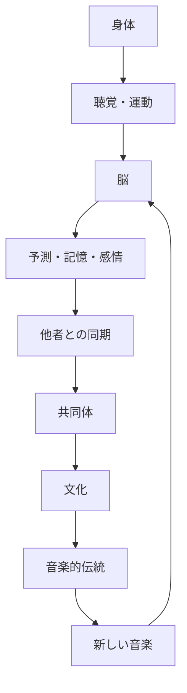

## 26. Why does the human brain wait for the "next sound"?

Text: mmr｜Theme: "Did music exist before writing?" We will delve into the question from the timeline of humanity itself.

### Listening to music is also about making predictions.

When listening to music, the human brain does not simply receive the sound.

Predicting what's coming next.

If the rhythm repeats, predict the next beat.

If the melody continues, predict the pitch of the next note.

If the same phrase is repeated over and over again, we expect it to continue.

And when that prediction comes true, it feels natural.

On the other hand, when a sound comes in that you weren't expecting, your attention shifts.

This property is extremely important in understanding music.

Music is not an experience of listening to individual sounds.

It is also an experience of remembering sounds heard in the past and predicting the next sound based on that.

---

### Betrayal makes sense because it's predictable.

Music that is completely unpredictable is difficult to understand.

But even perfectly predictable music can quickly become boring.

Music has some regularity.

Change occurs within that regularity.

The rhythm repeats.

After that, there's a beat.

The melody progresses.

A different sound comes than I expected.

The same code continues.

Suddenly, it shifts to a different sound.

This combination of ""prediction and change'' becomes an important characteristic of music.

Of course, not all music uses this mechanism in the same way.

However, the fact that humans predict the future based on past sounds when listening to music has become an important theme in cognitive research.

> The fun of music comes not only from the sounds themselves, but also from people's predictions of what will come next.

---

## 27. Rhythm enters the body before the brain.

### Humans don't just listen to sounds, they move

Rhythmic features are not processed only by the ear.

When you listen to music, your body reacts.

Move your head.

Step on your foot.

Tap your finger on the desk.

Walking speed changes.

dance.

These reactions demonstrate the deep relationship between sound and movement.

Rhythm, in particular, has a temporal structure.

There's a sound.

There is a pause.

The next sound is heard.

Another sound comes.

By anticipating this interval, the body prepares to move.

### Beats are not "things that exist"

What is interesting is that the musical beat itself does not exist as an object.

For example, a drum sounds at regular intervals.

We feel the "beat" from there.

However, the beat is not something floating in space.

The human brain constructs sounds based on their temporal relationships.

In other words, listening to music is not just about receiving the sounds coming from outside.

The brain creates a temporal structure.

It is precisely because of this ability that rhythm can be created from a simple sequence of sounds.

### Even "silence" can become a rhythm

What's even more interesting is that even the moments without sound become part of the music.

sound.

No sound.

sound.

No sound.

When this interval is repeated, it becomes a rhythm.

In other words, music is not just made of sound.

The time between sounds is also important.

This means that human hearing can handle not only ""existing things" but also ""non-existent time" as structures.

> Rhythm does not exist within the sounds, but is created by humans organizing the time between sounds.

---

## 28. Why does listening to the same rhythm over and over feel good?

### Repetition is widespread in human culture

Music has a lot of repetition.

Rust.

Riff.

beat.

phrase.

baseline.

melody.

The same pattern appears over and over again.

But repetition is not just a feature of music.

It's also in language.

It's also in the story.

It's also a ritual.

It's also found in dance.

It is also found in architecture.

It's also in the pattern.

There is a great deal of repetition in human culture.

### Repetition makes learning possible

If the same thing is repeated, the brain can learn the pattern.

I didn't understand the rhythm at first, but after listening to it a few times, I started to understand it.

Gradually, you will be able to predict melodies that you couldn't memorize at first.

When listeners become able to predict, they also notice small changes.

In other words, repetition not only creates monotony.

Change has meaning because of repetition.

### Children like repetition

Children's songs have a lot of repetition.

Same word.

Same melody.

Same rhythm.

This is also important for learning.

Children learn sound patterns through repetition.

And you"ll be able to predict what you"ve heard many times.

At this point, music is not just entertainment.

Create an environment that supports memory and learning.

However, this does not prove that ""music evolved for children's learning''.

Rather, it means that the human learning ability and the repetitive nature of music are highly compatible.

> Repetition does not make music simple. Repetition allows humans to detect small differences.

---

## 29. Why are music and memory so strongly connected?

### Why a melody once heard remains for a long time

Humans have the ability to memorize music for long periods of time.

Sometimes I remember a song I heard decades ago the moment I hear it for the first time.

Sometimes I even remember the lyrics.

Sometimes you can tell the name of a song just from the intro.

This is thought to be because music organizes multiple pieces of information simultaneously.

The pitch of the sound.

rhythm.

tempo.

Tone.

words.

Emotions.

Where you heard it.

The time you listened.

personal experience.

These may be linked into one memory network.

### Music compresses time

When you look at a photo, visual information from that moment comes back to you.

However, music contains time itself.

the beginning of the song.

Expand.

repetition.

end.

Therefore, listening to a song can bring back memories from a certain period of time all at once.

The music I listened to in high school.

The first record I bought.

A song that was playing in a certain place.

Music you listened to with someone.

These memories are not just memories of sounds.

Music is connected to time in an individual's life.

### Also serves as a cultural memory

This is not limited to individuals.

Music also preserves social memory.

A song from a certain era.

A folk song from a certain region.

religious song.

political movement song.

Labor song.

funeral music.

festive music.

These are not just sound works.

It is tied to events and values ​​experienced by society.

Even in cultures where no written language remains, music and songs can support memories between generations.

However, its specific form differs from culture to culture.

> Music can be a way not only to explain the past, but also to replay it in the body.

---

## 30. Why does the body move according to the rhythm?

### The border between sound and movement is thin

When humans listen to sound, they do not remain completely still.

Minor physical movements may occur.

Move your head.

Move your fingers.

Move your legs.

Shake your body.

This shows that there is a close relationship between music and exercise.

The brain contains networks that link auditory information and motor control.

Move while listening to the sound.

Make sounds while moving.

These two are a natural combination for humans.

### When you make the sound yourself, it becomes even stronger

When your own body produces sound, the relationship becomes even more direct.

Clap your hands.

Step on your foot.

Beat the drum.

play an instrument.

Speak out.

Your movements become sounds.

Then listen to that sound and adjust your next move.

This is a kind of feedback.

flowchart LR
    A["Body movement"] --> B["There's a sound"]
    B --> C["Hearing"]
    C --> D["The brain recognizes temporal patterns"]
    D --> E["Predict the next move"]
    E --> A

This loop is also one of the basic structures of musical performance.

### It gets even more complicated in groups.

When you create a rhythm by yourself, you only need to adjust your own movements.

When there are two people, it is necessary to match the timing with the other person.

If there are ten people, things get even more complicated.

When hundreds of people listen to the same music, they share the same temporal structure, even if they don't actually move in the same way.

This is where the social power of music lies.

> Music connects hearing and movement, and also connects one's body with the bodies of others.

---

## 31. Why are humans able to "synchronize"?

### Special ability to synchronize to the same beat

When multiple people move to the same rhythm, it is called "synchronization."

This is extremely important in human musical behavior.

applause.

Chorus.

dance.

march.

Group performance.

All of these require some degree of synchronization.

Humans can adjust the timing of their movements while listening to sounds.

This is not a simple reflex.

It requires recognizing sound patterns, predicting the next timing, and moving the body.

### Sound makes it easier to sync

Multiple people can move simultaneously using just vision.

However, sound has strong characteristics that support synchronization.

The sound is clear in time.

One beat of the drum.

applause.

footsteps.

shout.

These clarify the timing of "now."

Therefore, sound can be used as a means to organize collective action.

### Collaborative synchronization has social meaning

When we move at the same time, individual actions become collective actions.

One person's applause is just a sound.

The applause of a thousand people becomes a collective phenomenon.

One person's singing voice is a voice.

A chorus of 1,000 people has a different sound.

Here, a phenomenon arises that is not simply the sum of individual abilities.

The group itself has a rhythm.

This may have been an important feature in the creation of large human communities.

> Synchronization temporarily transforms individuals into a group by placing multiple people within the same temporal structure.

---

## 32. Music and reward system

### Why do you want to listen to it again?

Music can be accompanied by strong pleasure.

Listen to your favorite songs.

Your favorite phrase will come.

The chorus begins.

The development I had been looking forward to has arrived.

Strong emotions arise at that moment.

In neuroscience, the nervous system involved in the pleasure and reward caused by music is being studied.

In particular, the relationship between neurotransmitters such as dopamine and the pleasure caused by music is being studied.

The important thing is not to simply think of ""dopamine = pleasure.''

Dopamine is involved in multiple functions, including reward prediction and motivation.

### Linking predictions and rewards

In music, expectations are important.

If you know the song, you can predict what will happen next.

But it's not exactly the same.

It changes just a little.

When the change matches or moderately violates expectations, strong reactions can occur.

This is being studied as one of the reasons why music's ""prediction and surprise'' are related to pleasure.

### That's why unknown music is also interesting

If humans only liked sounds that were completely predictable, it would be difficult to create new music.

But in reality, humans search for new music.

A new genre.

new artist.

new rhythm.

A new tone.

new structure.

There is a possibility that ""newness within the scope of understanding'' is relevant here.

It's not complete chaos, but some pattern exists.

Then new elements are added.

This combination makes it possible to learn unknown music.

> Humans don't just want predictable sounds. I am looking for ""unpredictable moments'' in a predictable world.

---

## 33. Why music has "tension" and "release"

### The human brain is sensitive to changes in sound

Music has tension and release.

The sound gets louder.

The dissonant sound continues.

The rhythm becomes stronger.

The volume increases.

And suddenly, it calms down.

This is sometimes expressed as "tension and release."

Of course, not all music uses this structure.

However, mechanisms for creating and changing expectations can be found in many musical cultures.

### Music uses "time"

In visual art, a picture can be seen as a whole.

Music can only exist within time.

When you hear the first note, the end of the song doesn't exist yet.

However, the brain predicts the future while remembering past sounds.

That's why music has a sense of "waiting."

Wait for the next sound.

Wait for the next beat.

Wait for the chorus.

Wait for the end.

This structure of "waiting" is what makes music special.

### When predictions are wrong, attention is turned.

Sudden changes attract attention.

A loud sound plays in the middle of quiet music.

The constant beat suddenly stops.

The melody goes in an unexpected direction.

These change the listener's expectations.

Musicians learn this system culturally and use it consciously.

However, underlying this is the human brain's ability to predict temporal patterns.

> Music is an art that allows the human brain, which has not yet heard the future, to predict the future.

---

## 34. Is music "universal"?

### Does every human society have music?

When talking about music, it is sometimes said that ""music is something that all humankind has in common.''

In a broader sense, singing, dancing, musical instruments, rhythm, or similar acoustic behavior exists in almost all human societies.

However, it is not appropriate to think that ""there is a category of music in all cultures around the world that has the same meaning as Western music.''

In some cultures, music, dance, rituals, stories, religion, etc. are not separated.

In other words, it is more accurate to think that what is universal is not the specific concept of ""music'' but the tendency of humans to organize sounds and use them for social and cultural activities.

### Music varies greatly depending on culture

The scale is different.

The rhythm is also different.

The instruments are also different.

The way they play is also different.

What we consider "good music" also differs.

Some cultures do not know Western functional harmony.

Some cultures have complex political rhythms.

There is also music that emphasizes timbre rather than pitch.

There is also a tradition that emphasizes improvisation.

This diversity shows that music is not a simple biological program.

### Biology and culture are not in conflict

The important thing here is to avoid binary choices between ""biological" and ""cultural."

Humans have the ability to hear sounds, perceive time, move their bodies, and learn patterns.

How this ability is used varies by culture.

In other words,

flowchart TD
    A["Human body/brain"] --> B["Ability to recognize sounds"]
    B --> C["Time, Pattern, Prediction"]
    C --> D["Cultural learning"]
    D --> E["musical tradition"]
    E --> F["New music"]
    F --> D

It can be thought of as a cycle.

Biology creates possibilities, and culture expands them in countless directions.

Music is born from the combination of both.

> The human brain makes music possible, and culture infinitely changes that music.

---

## 35. Do animals have music too?

### Thinking from bird songs

Animals other than humans also have complex vocal behaviors.

Bird songs are a prime example.

Birds learn, repeat, and change specific patterns.

In some bird species, the process by which young birds learn adult songs has been studied.

This is not exactly the same as human musical culture.

However, it is interesting in that complex speech patterns can be transmitted through learning.

### Whale vocalizations

Cetaceans also have complex vocalizations.

The songs of humpback whales in particular have been studied for a long time.

Songs have a repeating structure and are known to change within a population.

These studies show that complex vocal cultures are not just a human phenomenon.

However, you need to be careful here as well.

The complex vocalizations of animals cannot be treated as the same thing as human "music."

### The uniqueness of humans lies in the "accumulation of culture"

A particularly important characteristic of humans is that culture accumulates over generations.

One person creates new technology.

Others learn.

improve it.

Another generation will improve it.

The result is a culture of greater complexity than existed in the original individual.

The same goes for music.

One rhythm.

One instrument.

one song.

It changes over generations.

The end result is a huge musical system.

This is related to an important human characteristic called ""cultural accumulation.''

> What makes human music special is not just the ability to produce sound, but the ability to accumulate a sonic culture across generations.

---

## 36. If music wasn"t necessary for survival, why didn"t it disappear?

### The question of "adaptation or by-product"

Broadly speaking, there are multiple ways of thinking about the evolution of music.

The idea that music itself has an adaptive function.

The idea that music arose as a byproduct of other abilities, such as language, movement, hearing, and social cognition.

The idea that it developed as a result of a combination of multiple abilities.

Research debates regarding these issues continue.

There is no one definitive answer.

### However, the "indelibility" of music is important.

If music was a completely meaningless activity, why did it persist for so long in human society?

Of course, ""existing for a long time'' alone cannot prove biological adaptability.

Some cultures persist even when they have no direct survival advantage.

But the music

* Parent-child relationship
* Collective synchronization
* Social cohesion
* memory
* Ceremony
* Emotional expression
* Entertainment
* Identity

It is important that the company is involved in many areas such as this.

In other words, music is not a culture that depends on one function.

### Possibility of survival due to multi-functionality

If music can be used in a variety of situations, even if one use is lost, another remains.

Even if the form of hunting changes, the songs remain.

Even if agriculture changes, festivals will remain.

Even if religion changes, music will remain.

Even if the media changes, the song will remain.

Even with the advent of recording technology, live performance remains.

Even with the advent of streaming, humans still perform.

This flexibility may be the strength of music.

>Music was not a tool for one task, but a cultural ability that could be used to enter into various tasks in human society.

---

## 37. Music goes well with "human prediction machines"

### The brain does not view the world completely passively.

The human brain does not just receive information from the outside world.

Use past experience to predict what will happen next.

This also happens visually.

It also happens with language.

It also happens with exercise.

It happens with music too.

Music takes this predictive power to an extreme.

Guess the tempo from the first few beats.

Guess the key or tonality.

Predict the direction of the melody.

Predict the period of the rhythm.

Memorize the structure of a song.

Then compare the predicted and actual sounds.

### Between "I understand" and "I"m surprised"

What makes music interesting is neither complete prediction nor complete surprise.

I"m thinking, "This is what"s next."

But it's a little different.

This difference becomes important.

For example, in a pop song, you can predict the chorus.

However, if the sound stops for a moment just before the chorus, the actual chorus may feel even stronger.

Jazz involves improvisational changes on top of predictable rhythms.

In electronic music, subtle changes are made within repeating beats.

Experimental music can sometimes destroy predictions themselves.

Still, the listener tries to understand the broken rules.

### The history of music is also the history of "manipulating predictions"

Looking at music history from this perspective is very interesting.

classical music.

jazz.

rock.

hip hop.

Techno.

Ambient.

noise.

Amapiano.

Each manipulates the listener's expectations in a different way.

The creation of a genre also means that listeners learn certain rules.

Follow that rule.

Change it a little.

Change it to the extreme.

and create new rules.

The history of music can also be read as a history of such "expectations and changes."

> New music doesn't come out of thin air, but rather by changing existing expectations.

---

## 38. Why is "silence" sometimes scary?

### What does the brain do when there is no sound?

When we think about music, we tend to focus on the sound itself.

But silence is also important.

When the sound stops in the middle of music, the listener may feel that ""something is happening.''

A loud sound comes after a quiet part.

The rhythm stops.

The voice disappears.

At that moment, attention is heightened.

This is not because the sound has disappeared.

This is because the brain recognizes that the sound that is supposed to be there is not there.

### "Sounds that don"t exist" created by predictions

If you keep listening to a certain beat, you can predict the next beat.

That's where the beat goes.

There's actually no sound.

However, the listener may feel the position.

This is a very important phenomenon in music.

Musicians create rhythm not only by making sounds, but also by not making sounds.

### There is also a connection with prehistory here.

Humans' ability to understand rhythm did not originate solely from modern music theory.

walk.

run.

Breathe.

Move with others.

Listen to the sound.

Through these experiences, humans have learned the patterns of time.

This ability was later used for complex musical structures.

In other words, behind today's complex rhythms lies a very ancient ""body that predicts time.''

> Music is not an art of arranging sounds. It is also an art that allows us to predict both where the sound will come and where it will not come.

---

## 39. Music changes people's sense of time

### A few minutes of music becomes an "event"

When listening to music, several minutes can sometimes feel like a single whole.

Intro.

Expand.

repetition.

climax.

end.

This is because humans structure their time.

Clock time flows evenly.

However, the time experienced is not uniform.

Bored time feels like a long time.

My concentration time feels short.

In music, time itself becomes structured.

### Tempo changes the body's time

Listening to fast music can make your body move faster.

Slow music can also slow down your movements.

Of course, not everyone will react the same way.

There are also cultural and individual differences.

Still, it has been widely studied that musical tempo influences people's sense of time and movement.

### Unite group time

It"s not just the individual"s sense of time.

When listening to music in a group, multiple people share the same temporal structure.

"It"s exciting here."

"Stop here."

"Here comes the chorus."

People who know the same song can predict the same moment.

This creates a strong communal experience at live performances, festivals, clubs, concerts, ceremonies, etc.

> Music gives humans the feeling of ""sharing the same time.''

---

## 40. Why music did not disappear from human society

### Music is not limited to one function

To summarize the discussion so far, music has multiple layers.

First, there is the body.

Listen to the sound.

Recognize time.

Move.

Next is the brain.

Learn patterns.

Predict.

Remember.

Process emotions.

And then there is society.

Synchronize with others.

Share the song.

perform a ritual.

Convey memories.

Inherit the culture.

There is also a culture.

Create a genre.

Make rules.

Break the rules.

Create a new format.

When these things overlap, they become music.

This cycle shows why it is difficult to explain music in terms of just one evolutionary purpose.

Music utilizes multiple human abilities simultaneously.

### And culture continues to create new music

Once a musical culture is established, it itself creates the next music.

New generations learn the music of the past.

But don't copy it completely.

Change it a little.

Combine with another culture.

Use a new instrument.

Adapt to new social environment.

Take advantage of new technology.

In this way, music changes so that it reproduces itself.

This is different from biological evolution.

However, we can see a process of ""mutation, inheritance, and selection'' that is similar to evolution.

### Humans don't just make music, they choose music

A song becomes popular.

Other songs are forgettable.

A certain rhythm becomes popular.

Alternative rhythms remain in some areas.

A certain instrument spreads out.

Another instrument disappears.

This choice depends on many factors, including cultural, economic, technological, social, and personal preferences.

Therefore, music history is not just the history of musicians.

It is also the history of the listener.

> Music has evolved not only by being created, but also by being listened to, memorized, selected, and changed.

---

## 41. Humans were animals that turned "sound" into culture.

### Humans are not the only ones with the ability to hear sounds.

Animals also hear sounds.

Animals also make sounds.

Animals also behave in rhythm.

Therefore, music cannot be simply defined as an ability unique to humans.

The uniqueness of humans lies in their ability to culturally accumulate sounds.

Other people memorize patterns created by one person.

The pattern is transmitted to another person.

Changes across generations.

It will remain even if society changes.

And I consciously quote music from the past.

This ability to ""create new music using the past as material'' is a major characteristic of human culture.

### Music has become a cultural memory device for humans.

In pre-literate societies, there were limited ways to preserve culture.

Therefore, a format that is easy to remember is important.

Repetition.

rhythm.

melody.

story.

body movement.

These are easily associated with memories.

Music itself does not store information perfectly.

However, musical structures can support human memory.

Therefore, songs have been used as a medium to convey stories, history, religion, and community memory.

### characters came after

Writing gave another form to this cultural memory.

talk.

sing.

learn by heart.

tell.

In the world of

write.

read.

Save.

A new method has been added.

However, even with the advent of writing, music did not disappear.

That"s because music didn"t just store information.

Music has a body.

I have feelings.

There is synchronization.

There is a community.

And there's time.

> Writing transferred human memory to matter, but music continued to preserve human memory within the body.

---

## 42. Conclusion of Part 3: Music is born between the "brain that predicts" and the "body that synchronizes"

The origin of music cannot be explained solely from human history.

It cannot be explained using language alone.

Society alone is not enough.

There is a human brain and body.

Humans listen to sounds.

measure time.

Learn patterns.

Predict what's next.

The prediction comes true.

Sometimes we are betrayed.

Then, move your body according to the sound.

Coordinate movements with others.

share the same sound.

Remember that experience.

Pass it on to the next generation.

Through this repetition, sound becomes not just environmental information, but culture.

Here, the question that has been going on since Part 1 appears in a slightly different form.

"Why did humans invent music?"

For this question, it is impossible to find a single inventor or a single moment.

but,

**Humans have the ability to recognize sounds as patterns, predict time, synchronize their bodies, share them with others, and inherit these patterns as culture. **

This combination made music possible.

And once that ability becomes a culture, music can enter almost every corner of human society.

Parent-child relationship.

love affair.

Ceremony.

religion.

war.

work.

festival.

Funeral.

Politics.

Entertainment.

and personal memory.

However, one big mystery still remains.

Humans don't just make music.

**Gives meaning to music. **

Some songs become sacred.

A certain rhythm becomes a symbol of a nation.

Some songs are associated with political movements.

Certain melodies remind me of home.

A genre becomes the identity of a generation.

In other words, music does not end only in the brain.

Music organizes society itself.

And at that moment, the original question becomes even bigger.

**How ​​did music, which may have existed before writing, become part of religion, mythology, ritual, community, and ultimately civilization? **

To find the answer, we must move from the ""sounds" of prehistoric times to the ""sounds" that create society.

> Music began with a predictive brain and a moving body, and became a culture through synchronization with others. Music, which became a culture, eventually became one of the ways humans understand the world itself.

---
