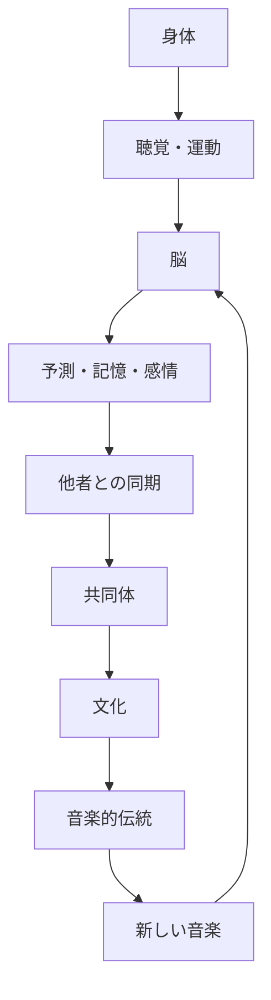

## 26. なぜ人間の脳は「次の音」を待つのか

文：mmr｜テーマ：「音楽は文字より前に存在したのか？」という問いを、人類の時間軸そのものから掘り下げます

### Listening to music is also about making predictions.

When listening to music, the human brain does not simply receive the sound.

次に何が来るのかを予測している。

リズムが繰り返されれば、次の拍を予想する。

メロディーが続けば、次の音の高さを予想する。

同じフレーズが何度も繰り返されれば、その続きを期待する。

そして、その予測が当たると「自然だ」と感じる。

On the other hand, when a sound comes in that you weren't expecting, your attention shifts.

この性質は、音楽を理解するうえで極めて重要だ。

音楽は、音を一つずつ聴く体験ではない。

過去に聴いた音を記憶し、それをもとに次の音を予測する体験でもある。

---

### 予測できるから、裏切りが意味を持つ

完全に予測できない音楽は、理解することが難しい。

しかし、完全に予測できる音楽も、すぐに退屈になる。

音楽には、ある程度の規則性がある。

その規則性の中に変化が入る。

リズムが繰り返される。

その後で、一拍抜ける。

メロディーが進む。

A different sound comes than I expected.

同じコードが続く。

突然、別の響きに移る。

This combination of ""prediction and change'' becomes an important characteristic of music.

もちろん、すべての音楽が同じ方法でこの仕組みを使うわけではない。

しかし、音楽を聴くときに人間が過去の音から未来を予測していることは、認知研究において重要なテーマになっている。

> 音楽の面白さは、音そのものだけではなく、「次に何が来るのか」という人間の予測から生まれる。

---

## 27. リズムは、脳より先に身体に入ってくる

### 人間は音を聴くだけでなく、動く

リズムの特徴は、耳だけで処理されるわけではない。

音楽を聴くと、身体が反応する。

Move your head.

足を踏む。

指で机を叩く。

歩く速度が変わる。

踊る。

こうした反応は、音と運動の深い関係を示している。

Rhythm, in particular, has a temporal structure.

音が鳴る。

間がある。

The next sound is heard.

さらに次の音が来る。

By anticipating this interval, the body prepares to move.

### Beats are not "things that exist"

What is interesting is that the musical beat itself does not exist as an object.

For example, a drum sounds at regular intervals.

私たちはそこから「拍」を感じる。

However, the beat is not something floating in space.

The human brain constructs sounds based on their temporal relationships.

In other words, listening to music is not just about receiving the sounds that come from outside.

The brain creates a temporal structure.

It is precisely because of this ability that rhythm can be created from a simple sequence of sounds.

### Even "silence" can become a rhythm

What's even more interesting is that even the moments without sound become part of the music.

音。

No sound.

sound.

無音。

この間隔が繰り返されると、リズムになる。

つまり、音楽は音だけでできているわけではない。

音と音の間にある時間も重要だ。

これは人間の聴覚が「存在するもの」だけでなく、「存在しない時間」も構造として扱えることを意味する。

> リズムは音の中にあるのではなく、音と音の間にある時間を人間が組織することで生まれる。

---

## 28. なぜ同じリズムを何度も聴くと気持ちよくなるのか

### 反復は人間の文化に広く存在する

音楽には反復が多い。

Rust.

リフ。

ビート。

phrase.

baseline.

melody.

同じパターンが何度も現れる。

But repetition is not just a feature of music.

It's also in language.

物語にもある。

儀礼にもある。

踊りにもある。

It is also found in architecture.

模様にもある。

人間の文化には、反復が非常に多い。

### 反復は学習を可能にする

If the same thing is repeated, the brain can learn the pattern.

I didn't understand the rhythm at first, but after listening to it a few times, I started to understand it.

最初は覚えられなかったメロディーを、次第に予測できるようになる。

When listeners become able to predict, they also notice small changes.

In other words, repetition not only creates monotony.

Change has meaning because of repetition.

### 子どもは繰り返しを好む

Children's songs have a lot of repetition.

同じ言葉。

Same melody.

同じリズム。

This is also important for learning.

子どもは繰り返しを通じて、音のパターンを学ぶ。

そして、何度も聞いたものを予測できるようになる。

このとき、音楽は単なる娯楽ではない。

Create an environment that supports memory and learning.

ただし、これは「音楽は子どもの学習のために進化した」という証明ではない。

Rather, it means that the human learning ability and the repetitive nature of music are highly compatible.

> 繰り返しは音楽を単純にするのではない。繰り返しがあるから、人間は小さな違いを発見できる。

---

## 29. Why are music and memory so strongly connected?

### Why a melody once heard remains for a long time

Humans have the ability to memorize music for long periods of time.

Sometimes I remember a song I heard decades ago the moment I hear it for the first time.

Sometimes I even remember the lyrics.

イントロだけで曲名が分かることもある。

これは、音楽が複数の情報を同時に組織するからだと考えられる。

音の高さ。

rhythm.

tempo.

Tone.

words.

Emotions.

Where you heard it.

The time you listened.

personal experience.

These may be linked into one memory network.

### 音楽は時間を圧縮する

写真を見ると、その瞬間の視覚情報が戻ってくる。

しかし音楽は、時間そのものを含んでいる。

曲の最初。

Expand.

repetition.

end.

Therefore, listening to a song can bring back memories from a certain period of time all at once.

高校時代に聴いていた音楽。

The first record I bought.

A song that was playing in a certain place.

誰かと一緒に聴いた音楽。

こうした記憶は、単なる音の記憶ではない。

Music is connected to time in an individual's life.

### Also serves as a cultural memory

This is not limited to individuals.

音楽は社会の記憶も保存する。

A song from a certain era.

A folk song from a certain region.

宗教的な歌。

political movement song.

Labor song.

葬儀の音楽。

festive music.

これらは、単なる音響作品ではない。

It is tied to events and values ​​experienced by society.

文字が残っていない文化でも、音楽や歌が世代間の記憶を支えることがある。

However, its specific form differs from culture to culture.

> Music can be a way not only to explain the past, but also to replay the past in the body.

---

## 30. なぜリズムに合わせて身体が動くのか

### 音と運動の境界は薄い

When humans listen to sound, they do not remain completely still.

Minor physical movements may occur.

Move your head.

指を動かす。

足を動かす。

Shake your body.

これは音楽と運動の間に密接な関係があることを示している。

脳には、聴覚情報と運動制御を結びつけるネットワークが存在する。

音を聴きながら動く。

Make sounds while moving.

この二つは人間にとって自然な組み合わせになっている。

### When you make the sound yourself, it becomes even stronger

自分の身体が音を生み出す場合、その関係はさらに直接的になる。

手を叩く。

Step on your foot.

Beat the drum.

play an instrument.

Speak out.

Your movements become sounds.

Then listen to that sound and adjust your next move.

This is a kind of feedback.

flowchart LR
    A["身体の動き"] --> B["There's a sound"]
    B --> C["Hearing"]
    C --> D["The brain recognizes temporal patterns"]
    D --> E["次の動きを予測"]
    E --> A

This loop is also one of the basic structures of musical performance.

### It gets even more complicated in groups.

一人でリズムを作る場合、自分の動きだけを調整すればいい。

二人になると、相手とのタイミングを合わせる必要がある。

十人なら、さらに複雑になる。

数百人が同じ音楽を聴いている場合、実際に同じ動きをするわけではなくても、同じ時間構造を共有することになる。

This is where the social power of music lies.

> 音楽は、聴覚と運動をつなぎ、さらに一人の身体と他者の身体をつなぐ。

---

## 31. Why are humans able to "synchronize"?

### Special ability to synchronize to the same beat

When multiple people move to the same rhythm, it is called "synchronization."

This is extremely important in human musical behavior.

拍手。

Chorus.

ダンス。

行進。

Group performance.

All of these require some degree of synchronization.

Humans can adjust the timing of their movements while listening to sounds.

これは単純な反射ではない。

音のパターンを認識し、次のタイミングを予測し、身体を動かす必要がある。

### 音があると、同期しやすい

Multiple people can move simultaneously using just vision.

However, sound has strong characteristics that support synchronization.

音は時間的に明確だ。

ドラムの一打。

applause.

footsteps.

掛け声。

これらは「今」というタイミングを明確にする。

Therefore, sound can be used as a means to organize collective action.

### 共同同期には社会的意味がある

When we move at the same time, individual actions become collective actions.

一人の拍手は単なる音だ。

千人の拍手は集団の現象になる。

One person's singing voice is a voice.

A chorus of 1,000 people has a different sound.

ここでは、個人の能力を足し合わせただけではない現象が生まれる。

集団そのものが一つのリズムを持つ。

これは、人間が巨大な共同体を作るうえでも重要な特徴になった可能性がある。

> 同期は、複数の人間を同じ時間構造の中に置くことで、個人を一時的に集団へ変える。

---

## 32. 音楽と報酬系

### なぜ「もう一度聴きたい」と思うのか

Music can be accompanied by strong pleasure.

Listen to your favorite songs.

お気に入りのフレーズが来る。

サビが始まる。

期待していた展開が訪れる。

その瞬間に強い感情が生まれる。

脳科学では、音楽による快感と報酬に関係する神経系が研究されている。

特に、ドーパミンなどの神経伝達物質と音楽による快感との関係が研究されている。

重要なのは、単純に「ドーパミン＝快楽」と考えないことだ。

ドーパミンは報酬予測や動機づけなど、複数の機能に関係している。

### Linking predictions and rewards

音楽では、期待が重要だ。

知っている曲なら、次の展開が予想できる。

しかし完全には同じではない。

少しだけ変化する。

その変化が期待と一致したり、適度に裏切ったりすると、強い反応が生まれることがある。

This is being studied as one of the reasons why music's ""prediction and surprise'' are related to pleasure.

### だから未知の音楽も面白い

もし人間が完全に予測できる音だけを好むなら、新しい音楽は生まれにくい。

But in reality, humans search for new music.

A new genre.

新しいアーティスト。

new rhythm.

新しい音色。

new structure.

ここには、「理解できる範囲の新しさ」が関係する可能性がある。

It's not complete chaos, but some pattern exists.

Then new elements are added.

This combination makes it possible to learn unknown music.

> Humans don't just want predictable sounds. I am looking for ""unpredictable moments'' in a predictable world.

---

## 33. 音楽に「緊張」と「解放」がある理由

### 人間の脳は音の変化に敏感である

音楽には緊張と解放がある。

The sound gets louder.

The dissonant sound continues.

リズムが強くなる。

音量が上がる。

そして突然、落ち着く。

This is sometimes expressed as "tension and release."

もちろん、すべての音楽がこの構造を使うわけではない。

しかし、多くの音楽文化で、期待を作り、それを変化させる仕組みが見られる。

### 音楽は「時間」を利用する

視覚芸術では、一枚の絵を全体として見ることができる。

音楽は時間の中でしか存在できない。

最初の音を聴いたとき、曲の最後はまだ存在しない。

However, the brain predicts the future while remembering past sounds.

だから、音楽には「待つ」という感覚がある。

Wait for the next sound.

次の拍を待つ。

Wait for the chorus.

終止を待つ。

この「待つ」という構造が、音楽を特別なものにしている。

### 予測が外れると、注意が向く

Sudden changes attract attention.

A loud sound plays in the middle of quiet music.

一定のビートが突然止まる。

The melody goes in an unexpected direction.

これらは聴き手の予測を変更させる。

音楽家は、この仕組みを文化的に学習し、意識的に利用する。

However, underlying this is the human brain's ability to predict temporal patterns.

> Music is an art that allows the human brain, which has not yet heard the future, to predict the future.

---

## 34. 音楽は「普遍的」なのか

### Does every human society have music?

音楽について語るとき、「音楽は人類共通のものだ」と言われることがある。

大きな意味では、人間社会のほぼすべてに、歌、踊り、楽器、リズム、あるいはそれに近い音響的行動が存在する。

However, it is not appropriate to think that ""there is a category of music in all cultures around the world that has the same meaning as Western music.''

音楽、踊り、儀礼、物語、宗教などが分離されていない文化もある。

つまり、普遍的なのは特定の「音楽」という概念ではなく、人間が音を組織して社会的・文化的活動に利用する傾向だと考えるほうが正確だ。

### Music varies greatly depending on culture

The scale is different.

リズムも違う。

The instruments are also different.

演奏方法も違う。

What we consider "good music" also differs.

Some cultures do not know Western functional harmony.

Some cultures have complex political rhythms.

There is also music that emphasizes timbre rather than pitch.

即興を重視する伝統もある。

この多様性は、音楽が単純な生物学的プログラムではないことを示している。

### Biology and culture are not in conflict

The important thing here is to avoid binary choices between ""biological" and ""cultural."

人間には音を聴き、時間を認識し、身体を動かし、パターンを学習する能力がある。

How this ability is used varies by culture.

つまり、

flowchart TD
    A["Human body/brain"] --> B["音を認識する能力"]
    B --> C["時間・パターン・予測"]
    C --> D["文化的学習"]
    D --> E["musical tradition"]
    E --> F["新しい音楽"]
    F --> D

It can be thought of as a cycle.

生物学が可能性を作り、文化がその可能性を無数の方向へ広げる。

音楽は、その両方が重なって生まれる。

> 人間の脳が音楽を可能にし、文化がその音楽を無限に変える。

---

## 35. 動物にも音楽はあるのか

### 鳥の歌から考える

Animals other than humans also have complex vocal behaviors.

鳥の歌は代表的な例だ。

鳥は特定のパターンを学習し、繰り返し、変化させる。

一部の鳥類では、幼鳥が成鳥の歌を学習する過程が研究されている。

これは人間の音楽文化と完全に同じではない。

しかし、「複雑な音声パターンが学習によって伝わる」という点では興味深い。

### クジラの発声

クジラ類にも複雑な発声がある。

特にザトウクジラの歌は長く研究されてきた。

歌には繰り返される構造があり、個体群の中で変化することも知られている。

こうした研究は、複雑な音声文化が人間だけの現象ではないことを示す。

しかし、ここでも注意が必要だ。

動物の複雑な発声を、そのまま人間の「音楽」と同じものとして扱うことはできない。

### 人間の特殊性は「文化の累積」にある

人間の特徴として特に重要なのは、文化が世代を超えて累積することだ。

一人の人間が新しい技術を作る。

他の人が学ぶ。

それを改良する。

さらに別の世代が改良する。

その結果、元の個体には存在しなかったほど複雑な文化が形成される。

音楽も同じだ。

一つのリズム。

一つの楽器。

一つの歌。

それが世代を越えて変化する。

最終的には、巨大な音楽体系になる。

これは「文化的累積」と呼ばれる人間の重要な特徴と関係している。

> 人間の音楽を特別なものにしているのは、音を出す能力だけではなく、音の文化を世代を超えて累積できる能力である。

---

## 36. もし音楽が生存に必要なかったなら、なぜ消えなかったのか

### 「適応か副産物か」という問題

音楽の進化については、大きく分けて複数の考え方がある。

音楽そのものが適応的な機能を持ったという考え。

言語、運動、聴覚、社会認知など、別の能力の副産物として音楽が生まれたという考え。

複数の能力が組み合わさった結果として発展したという考え。

これらについて研究上の議論は続いている。

決定的な一つの答えはない。

### しかし、音楽の「消えなさ」は重要だ

もし音楽が完全に無意味な行動だったなら、なぜ人間社会でこれほど長く維持されたのか。

もちろん、「長く存在している」ことだけで生物学的な適応性を証明することはできない。

文化には、直接的な生存上の利点がなくても残るものがある。

しかし音楽が、

* 親子関係
* 集団同期
* 社会的結束
* 記憶
* 儀礼
* Emotional expression
* 娯楽
* アイデンティティ

など、多くの領域に入り込んでいることは重要だ。

つまり、音楽は一つの機能に依存している文化ではない。

### 多機能だから生き残った可能性

音楽がさまざまな場面で利用できるなら、一つの用途が失われても別の用途が残る。

狩猟の形式が変わっても歌は残る。

農業が変わっても祭りは残る。

宗教が変わっても音楽は残る。

メディアが変わっても歌は残る。

録音技術が登場してもライブ演奏は残る。

ストリーミングが登場しても人間は演奏する。

この柔軟性こそが、音楽の強さなのかもしれない。

> 音楽は一つの仕事をする道具ではなく、人間社会のさまざまな仕事に入り込める文化的な能力だった。

---

## 37. 音楽は「人間の予測機械」と相性がいい

### 脳は世界を完全に受け身で見ていない

人間の脳は、外界から入ってくる情報をただ受け取るだけではない。

過去の経験を利用して、次に起こることを予測する。

これは視覚でも起こる。

言語でも起こる。

It also happens with exercise.

音楽でも起こる。

音楽は、この予測能力を極端に利用する。

最初の数拍でテンポを推測する。

Guess the key or tonality.

メロディーの方向を予測する。

Predict the period of the rhythm.

曲の構造を覚える。

そして、予測と実際の音を比較する。

### 「分かる」と「驚く」の間

音楽の面白さは、完全な予測でも完全な驚きでもない。

「次にこれが来る」と思っている。

でも、少し違う。

この差が重要になる。

例えば、ポップソングではサビが来ることを予測できる。

However, if the sound stops for a moment just before the chorus, the actual chorus may feel even stronger.

ジャズでは、予測できるリズムの上に即興的な変化を加える。

電子音楽では、反復するビートの中に微細な変化を入れる。

実験音楽では、予測そのものを壊すこともある。

Still, the listener tries to understand the broken rules.

### 音楽史は「予測の操作」の歴史でもある

この視点から音楽史を見ると、非常に面白い。

クラシック音楽。

jazz.

ロック。

ヒップホップ。

テクノ。

アンビエント。

ノイズ。

アマピアノ。

それぞれが、異なる方法で聴き手の期待を操作する。

ジャンルが生まれるということは、聴き手が一定の規則を学習することでもある。

その規則を守る。

少し変える。

極端に変える。

そして新しい規則を作る。

音楽の歴史は、こうした「期待と変化」の歴史としても読むことができる。

> New music doesn't come out of thin air, but rather by changing existing expectations.

---

## 38. Why is "silence" sometimes scary?

### What does the brain do when there is no sound?

音楽について考えるとき、音そのものに注目しがちだ。

しかし、無音も重要だ。

When the sound stops in the middle of music, the listener may feel that ""something is happening.''

静かな部分の後に大きな音が来る。

リズムが止まる。

声が消える。

その瞬間、注意が高まる。

これは、音がなくなったからではない。

「本来あるはずの音がない」と脳が認識するからだ。

### 予測が作る「存在しない音」

一定のビートを聴き続けていると、次の拍を予測する。

そこでビートが抜ける。

実際には音が鳴っていない。

しかし、聴き手はその位置を感じることがある。

これは音楽の非常に重要な現象だ。

音楽家は、音を鳴らすだけでなく、鳴らさないことによってリズムを作る。

### ここにも先史時代との接点がある

人間がリズムを理解する能力は、現代の音楽理論だけで生まれたものではない。

歩く。

走る。

呼吸する。

他者と動く。

音を聴く。

こうした経験の中で、人間は時間のパターンを学んできた。

その能力が、後に複雑な音楽構造に利用された。

つまり、現代の複雑なリズムの背後には、非常に古い「時間を予測する身体」が存在する。

> 音楽は音を並べる芸術ではない。音が来る場所と、来ない場所の両方を予測させる芸術でもある。

---

## 39. 音楽は人間の時間感覚を変える

### A few minutes of music becomes an "event"

音楽を聴いていると、数分間が一つのまとまりとして感じられることがある。

イントロ。

展開。

repetition.

クライマックス。

終わり。

これは、人間が時間を構造化しているからだ。

時計の時間は均一に流れる。

しかし、経験される時間は均一ではない。

Bored time feels like a long time.

My concentration time feels short.

音楽の中では、時間そのものが構造化される。

### テンポが身体の時間を変える

速い音楽を聴けば、身体の動きも速くなることがある。

遅い音楽では、動きも落ち着くことがある。

Of course, not everyone will react the same way.

文化や個人差もある。

それでも、音楽のテンポが人間の時間感覚や運動に影響することは広く研究されている。

### Unite group time

個人の時間感覚だけではない。

集団で音楽を聴けば、複数の人間が同じ時間構造を共有する。

「ここで盛り上がる」

「ここで止まる」

「ここでサビに入る」

People who know the same song can predict the same moment.

This creates a strong communal experience at live performances, festivals, clubs, concerts, ceremonies, etc.

> 音楽は、人間に「同じ時間を共有している」という感覚を与える。

---

## 40. Why music did not disappear from human society

### 音楽は一つの機能に閉じていない

To summarize the discussion so far, music has multiple layers.

まず身体がある。

音を聴く。

時間を認識する。

Move.

次に脳がある。

パターンを学習する。

Predict.

Remember.

Process emotions.

そして社会がある。

他者と同期する。

歌を共有する。

儀礼を行う。

Convey memories.

Inherit the culture.

There is also a culture.

Create a genre.

Make rules.

Break the rules.

Create a new format.

When these things overlap, they become music.

この循環を見ると、音楽を一つの進化的目的だけで説明することが難しい理由が分かる。

Music utilizes multiple human abilities simultaneously.

### そして、文化が新しい音楽を作り続ける

一度音楽的文化が成立すると、それ自体が次の音楽を生み出す。

新しい世代は、過去の音楽を学ぶ。

しかし完全にはコピーしない。

少し変える。

Combine with another culture.

新しい楽器を使う。

新しい社会環境に適応する。

新しい技術を利用する。

In this way, music changes so that it reproduces itself.

This is different from biological evolution.

However, we can see a process of ""mutation, inheritance, and selection'' that is similar to evolution.

### Humans don't just make music, they choose music

A song becomes popular.

別の曲は忘れられる。

A certain rhythm becomes popular.

Alternative rhythms remain in some areas.

ある楽器が広がる。

Another instrument disappears.

This choice depends on many factors, including cultural, economic, technological, social, and personal preferences.

Therefore, music history is not just the history of musicians.

聴き手の歴史でもある。

> Music has evolved not only by being created, but also by being listened to, memorized, selected, and changed.

---

## 41. Humans were animals that turned "sound" into culture.

### Humans are not the only ones with the ability to hear sounds.

動物も音を聴く。

動物も声を出す。

動物もリズムを持つ行動をする。

だから、音楽を人間だけの能力として単純に定義することはできない。

The uniqueness of humans lies in their ability to culturally accumulate sounds.

Other people memorize patterns created by one person.

そのパターンが別の人間へ伝わる。

Changes across generations.

社会が変わっても残る。

And I consciously quote music from the past.

This ability to ""create new music using the past as material'' is a major characteristic of human culture.

### 音楽は人間の文化的記憶装置になった

In pre-literate societies, there were limited ways to preserve culture.

Therefore, a format that is easy to remember is important.

Repetition.

リズム。

melody.

story.

body movement.

These are easily associated with memories.

Music itself does not store information perfectly.

しかし、音楽的構造は人間の記憶を支えることができる。

Therefore, songs have been used as a medium to convey stories, history, religion, and community memory.

### characters came after

Writing gave another form to this cultural memory.

talk.

歌う。

learn by heart.

tell.

In the world of

write.

読む。

Save.

A new method has been added.

However, even with the advent of writing, music did not disappear.

なぜなら、音楽が提供していたものは情報保存だけではなかったからだ。

音楽には身体がある。

I have feelings.

There is synchronization.

There is a community.

And there's time.

> Writing transferred human memory to matter, but music continued to preserve human memory within the body.

---

## 42. Conclusion of Part 3: Music is born between the "brain that predicts" and the "body that synchronizes"

音楽の起源を人類史だけから説明することはできない。

It cannot be explained using language alone.

Society alone is not enough.

There is a human brain and body.

Humans listen to sounds.

measure time.

Learn patterns.

Predict what's next.

The prediction comes true.

Sometimes we are betrayed.

そして、その音に合わせて身体を動かす。

他者と動きを合わせる。

share the same sound.

Remember that experience.

Pass it on to the next generation.

この繰り返しによって、音は単なる環境情報ではなく、文化になる。

ここで、Part 1から続いてきた問いが少し違った形で見えてくる。

"Why did humans invent music?"

For this question, it is impossible to find a single inventor or a single moment.

but,

**人間には音をパターンとして認識する能力があり、時間を予測し、身体を同期させ、他者と共有し、そのパターンを文化として継承する能力がある。**

This combination made music possible.

And once that ability becomes a culture, music can enter almost every corner of human society.

親子関係。

love affair.

Ceremony.

religion.

戦争。

work.

祭り。

Funeral.

Politics.

Entertainment.

and personal memory.

However, one big mystery still remains.

Humans don't just make music.

**Gives meaning to music. **

Some songs become sacred.

A certain rhythm becomes a symbol of a nation.

ある曲は政治運動と結びつく。

Certain melodies remind me of home.

A genre becomes the identity of a generation.

In other words, music does not end only in the brain.

Music organizes society itself.

And at that moment, the original question becomes even bigger.

**How ​​did music, which may have existed before writing, become part of religion, mythology, ritual, community, and ultimately civilization? **

その答えを探すには、先史時代の「音」から、社会を作る「音」へ進まなければならない。

> Music began with a predictive brain and a moving body, and became a culture through synchronization with others. Music, which became a culture, eventually became one of the ways humans understand the world itself.

---

### YouTube Podcast

※このPodcastは英語ですが、自動字幕・翻訳で視聴できます

<iframe width="560" height="315" src="https://www.youtube.com/embed/BGOaLZ2obMs?si=6u-yL07zhJFloC6k" title="YouTube video player" frameborder="0" allow="accelerometer; autoplay; clipboard-write; encrypted-media; gyroscope; picture-in-picture; web-share" referrerpolicy="strict-origin-when-cross-origin" allowfullscreen></iframe>

---
