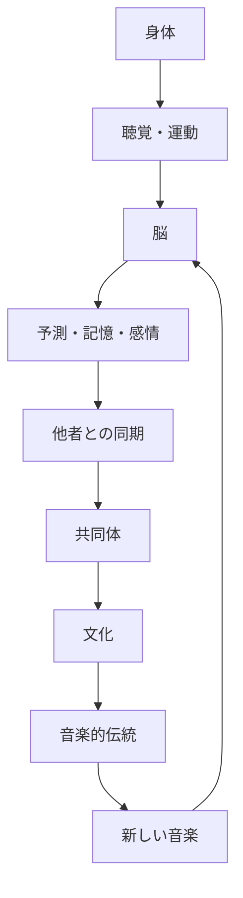

## 26. なぜ人間の脳は「次の音」を待つのか

文：mmr｜テーマ：「音楽は文字より前に存在したのか？」という問いを、人類の時間軸そのものから掘り下げます

### 音楽を聴くということは、予測することでもある

音楽を聴いているとき、人間の脳は単純に音を受け取っているわけではない。

次に何が来るのかを予測している。

リズムが繰り返されれば、次の拍を予想する。

メロディーが続けば、次の音の高さを予想する。

同じフレーズが何度も繰り返されれば、その続きを期待する。

そして、その予測が当たると「自然だ」と感じる。

逆に、予想していなかった音が入ると注意が向く。

この性質は、音楽を理解するうえで極めて重要だ。

音楽は、音を一つずつ聴く体験ではない。

過去に聴いた音を記憶し、それをもとに次の音を予測する体験でもある。

---

### 予測できるから、裏切りが意味を持つ

完全に予測できない音楽は、理解することが難しい。

しかし、完全に予測できる音楽も、すぐに退屈になる。

音楽には、ある程度の規則性がある。

その規則性の中に変化が入る。

リズムが繰り返される。

その後で、一拍抜ける。

メロディーが進む。

予想していた音とは違う音が来る。

同じコードが続く。

突然、別の響きに移る。

この「予測と変化」の組み合わせが、音楽の重要な特徴になる。

もちろん、すべての音楽が同じ方法でこの仕組みを使うわけではない。

しかし、音楽を聴くときに人間が過去の音から未来を予測していることは、認知研究において重要なテーマになっている。

> 音楽の面白さは、音そのものだけではなく、「次に何が来るのか」という人間の予測から生まれる。

---

## 27. リズムは、脳より先に身体に入ってくる

### 人間は音を聴くだけでなく、動く

リズムの特徴は、耳だけで処理されるわけではない。

音楽を聴くと、身体が反応する。

頭を動かす。

足を踏む。

指で机を叩く。

歩く速度が変わる。

踊る。

こうした反応は、音と運動の深い関係を示している。

特にリズムは、時間的な構造を持つ。

音が鳴る。

間がある。

次の音が鳴る。

さらに次の音が来る。

この間隔を予測することによって、身体は動く準備をする。

### 拍は「存在する物」ではない

興味深いのは、音楽の拍そのものが物体として存在するわけではないことだ。

例えば、一定の間隔でドラムが鳴る。

私たちはそこから「拍」を感じる。

しかし、拍は空間に浮かんでいる物ではない。

人間の脳が音の時間的関係から構成している。

つまり、音楽を聴くということは、外から入ってきた音をそのまま受け取るだけではない。

脳が時間的な構造を作っている。

この能力があるからこそ、単純な音の列からリズムが生まれる。

### 「無音」もリズムになる

さらに面白いのは、音がない時間も音楽の一部になることだ。

音。

無音。

音。

無音。

この間隔が繰り返されると、リズムになる。

つまり、音楽は音だけでできているわけではない。

音と音の間にある時間も重要だ。

これは人間の聴覚が「存在するもの」だけでなく、「存在しない時間」も構造として扱えることを意味する。

> リズムは音の中にあるのではなく、音と音の間にある時間を人間が組織することで生まれる。

---

## 28. なぜ同じリズムを何度も聴くと気持ちよくなるのか

### 反復は人間の文化に広く存在する

音楽には反復が多い。

サビ。

リフ。

ビート。

フレーズ。

ベースライン。

メロディー。

同じパターンが何度も現れる。

しかし、反復は音楽だけの特徴ではない。

言語にもある。

物語にもある。

儀礼にもある。

踊りにもある。

建築にもある。

模様にもある。

人間の文化には、反復が非常に多い。

### 反復は学習を可能にする

同じものが繰り返されれば、脳はそのパターンを学習できる。

最初は分からなかったリズムが、何度か聴くうちに分かるようになる。

最初は覚えられなかったメロディーを、次第に予測できるようになる。

そして、予測できるようになると、聴き手は細かな変化にも気づく。

つまり、反復は単調さを生むだけではない。

反復があるからこそ、変化が意味を持つ。

### 子どもは繰り返しを好む

子どもの歌には、反復が多い。

同じ言葉。

同じメロディー。

同じリズム。

これは学習のためにも重要だ。

子どもは繰り返しを通じて、音のパターンを学ぶ。

そして、何度も聞いたものを予測できるようになる。

このとき、音楽は単なる娯楽ではない。

記憶と学習を支える環境になる。

ただし、これは「音楽は子どもの学習のために進化した」という証明ではない。

むしろ、人間の学習能力と音楽の反復性が非常に相性がよいということだ。

> 繰り返しは音楽を単純にするのではない。繰り返しがあるから、人間は小さな違いを発見できる。

---

## 29. 音楽と記憶はなぜ強く結びつくのか

### 一度聴いたメロディーが長く残る理由

人間には、音楽を長期間記憶する能力がある。

何十年も前に聴いた曲を、久しぶりに聴いた瞬間に思い出すことがある。

歌詞まで覚えていることもある。

イントロだけで曲名が分かることもある。

これは、音楽が複数の情報を同時に組織するからだと考えられる。

音の高さ。

リズム。

テンポ。

音色。

言葉。

感情。

聴いた場所。

聴いた時期。

個人的な経験。

これらが一つの記憶ネットワークに結びつくことがある。

### 音楽は時間を圧縮する

写真を見ると、その瞬間の視覚情報が戻ってくる。

しかし音楽は、時間そのものを含んでいる。

曲の最初。

展開。

繰り返し。

終わり。

そのため、曲を聴くことで、ある期間の記憶が一気に呼び戻されることがある。

高校時代に聴いていた音楽。

初めて買ったレコード。

ある場所で流れていた曲。

誰かと一緒に聴いた音楽。

こうした記憶は、単なる音の記憶ではない。

音楽が個人の人生の時間と結びついている。

### 文化の記憶にもなる

これは個人だけに限らない。

音楽は社会の記憶も保存する。

ある時代の歌。

ある地域の民謡。

宗教的な歌。

政治運動の歌。

労働歌。

葬儀の音楽。

祝祭の音楽。

これらは、単なる音響作品ではない。

社会が経験した出来事や価値観と結びついている。

文字が残っていない文化でも、音楽や歌が世代間の記憶を支えることがある。

ただし、その具体的な形は文化ごとに異なる。

> 音楽は、過去を説明するだけでなく、過去を身体の中で再生する方法にもなり得る。

---

## 30. なぜリズムに合わせて身体が動くのか

### 音と運動の境界は薄い

人間は音を聴くとき、完全に静止しているわけではない。

微細な身体運動が起こることがある。

頭を動かす。

指を動かす。

足を動かす。

身体を揺らす。

これは音楽と運動の間に密接な関係があることを示している。

脳には、聴覚情報と運動制御を結びつけるネットワークが存在する。

音を聴きながら動く。

動きながら音を出す。

この二つは人間にとって自然な組み合わせになっている。

### 自分で音を出すと、さらに強くなる

自分の身体が音を生み出す場合、その関係はさらに直接的になる。

手を叩く。

足を踏む。

太鼓を叩く。

楽器を弾く。

声を出す。

自分の動きが音になる。

そして、その音を聴いて次の動きを調整する。

これは一種のフィードバックになる。

flowchart LR
    A["身体の動き"] --> B["音が発生"]
    B --> C["聴覚"]
    C --> D["脳が時間パターンを認識"]
    D --> E["次の動きを予測"]
    E --> A

このループは、音楽演奏の基本的な構造の一つでもある。

### 集団になると、さらに複雑になる

一人でリズムを作る場合、自分の動きだけを調整すればいい。

二人になると、相手とのタイミングを合わせる必要がある。

十人なら、さらに複雑になる。

数百人が同じ音楽を聴いている場合、実際に同じ動きをするわけではなくても、同じ時間構造を共有することになる。

ここに音楽の社会的な力がある。

> 音楽は、聴覚と運動をつなぎ、さらに一人の身体と他者の身体をつなぐ。

---

## 31. 人間はなぜ「同期」できるのか

### 同じ拍に合わせるという特殊な能力

複数人が同じリズムに合わせて動くことを「同期」と呼ぶ。

これは人間の音楽行動において非常に重要だ。

拍手。

合唱。

ダンス。

行進。

集団演奏。

これらはすべて、ある程度の同期を必要とする。

人間は音を聴きながら、自分の動作のタイミングを調整できる。

これは単純な反射ではない。

音のパターンを認識し、次のタイミングを予測し、身体を動かす必要がある。

### 音があると、同期しやすい

視覚だけで複数人が同時に動くこともできる。

しかし、音には同期を支える強い特徴がある。

音は時間的に明確だ。

ドラムの一打。

拍手。

足音。

掛け声。

これらは「今」というタイミングを明確にする。

そのため、音は集団行動を組織するための手段として利用できる。

### 共同同期には社会的意味がある

同じタイミングで動くと、個人の行動が集団の行動になる。

一人の拍手は単なる音だ。

千人の拍手は集団の現象になる。

一人の歌声は声だ。

千人の合唱は別の音響になる。

ここでは、個人の能力を足し合わせただけではない現象が生まれる。

集団そのものが一つのリズムを持つ。

これは、人間が巨大な共同体を作るうえでも重要な特徴になった可能性がある。

> 同期は、複数の人間を同じ時間構造の中に置くことで、個人を一時的に集団へ変える。

---

## 32. 音楽と報酬系

### なぜ「もう一度聴きたい」と思うのか

音楽には強い快感を伴うことがある。

好きな曲を聴く。

お気に入りのフレーズが来る。

サビが始まる。

期待していた展開が訪れる。

その瞬間に強い感情が生まれる。

脳科学では、音楽による快感と報酬に関係する神経系が研究されている。

特に、ドーパミンなどの神経伝達物質と音楽による快感との関係が研究されている。

重要なのは、単純に「ドーパミン＝快楽」と考えないことだ。

ドーパミンは報酬予測や動機づけなど、複数の機能に関係している。

### 予測と報酬が結びつく

音楽では、期待が重要だ。

知っている曲なら、次の展開が予想できる。

しかし完全には同じではない。

少しだけ変化する。

その変化が期待と一致したり、適度に裏切ったりすると、強い反応が生まれることがある。

これは、音楽の「予測と驚き」が快感と関係する理由の一つとして研究されている。

### だから未知の音楽も面白い

もし人間が完全に予測できる音だけを好むなら、新しい音楽は生まれにくい。

しかし実際には、人間は新しい音楽を探す。

新しいジャンル。

新しいアーティスト。

新しいリズム。

新しい音色。

新しい構造。

ここには、「理解できる範囲の新しさ」が関係する可能性がある。

完全な無秩序ではなく、ある程度のパターンが存在する。

その上で新しい要素が入る。

この組み合わせによって、未知の音楽が学習可能になる。

> 人間は予測できる音だけを求めているのではない。予測できる世界の中にある「予測できない瞬間」を探している。

---

## 33. 音楽に「緊張」と「解放」がある理由

### 人間の脳は音の変化に敏感である

音楽には緊張と解放がある。

音が高くなる。

不協和な響きが続く。

リズムが強くなる。

音量が上がる。

そして突然、落ち着く。

これを「緊張と解放」と表現することがある。

もちろん、すべての音楽がこの構造を使うわけではない。

しかし、多くの音楽文化で、期待を作り、それを変化させる仕組みが見られる。

### 音楽は「時間」を利用する

視覚芸術では、一枚の絵を全体として見ることができる。

音楽は時間の中でしか存在できない。

最初の音を聴いたとき、曲の最後はまだ存在しない。

しかし、脳は過去の音を記憶しながら、未来を予測する。

だから、音楽には「待つ」という感覚がある。

次の音を待つ。

次の拍を待つ。

サビを待つ。

終止を待つ。

この「待つ」という構造が、音楽を特別なものにしている。

### 予測が外れると、注意が向く

突然の変化は注意を引く。

静かな音楽の中で大きな音が鳴る。

一定のビートが突然止まる。

メロディーが予想外の方向へ進む。

これらは聴き手の予測を変更させる。

音楽家は、この仕組みを文化的に学習し、意識的に利用する。

しかし、その根底には、人間の脳が時間的パターンを予測するという性質がある。

> 音楽は、未来をまだ聴いていない人間の脳に、未来を予想させる芸術である。

---

## 34. 音楽は「普遍的」なのか

### すべての人間社会に音楽があるのか

音楽について語るとき、「音楽は人類共通のものだ」と言われることがある。

大きな意味では、人間社会のほぼすべてに、歌、踊り、楽器、リズム、あるいはそれに近い音響的行動が存在する。

しかし、「世界中の文化に西洋音楽と同じ意味での音楽というカテゴリーがある」と考えるのは適切ではない。

音楽、踊り、儀礼、物語、宗教などが分離されていない文化もある。

つまり、普遍的なのは特定の「音楽」という概念ではなく、人間が音を組織して社会的・文化的活動に利用する傾向だと考えるほうが正確だ。

### 文化によって音楽は大きく違う

音階は違う。

リズムも違う。

楽器も違う。

演奏方法も違う。

何を「良い音楽」と考えるかも違う。

西洋の機能和声を知らない文化もある。

複雑なポリリズムを持つ文化もある。

音程よりも音色を重視する音楽もある。

即興を重視する伝統もある。

この多様性は、音楽が単純な生物学的プログラムではないことを示している。

### 生物学と文化は対立しない

ここで重要なのは、「生物学的」か「文化的」かという二択を避けることだ。

人間には音を聴き、時間を認識し、身体を動かし、パターンを学習する能力がある。

その能力をどのように使うかは文化によって変わる。

つまり、

flowchart TD
    A["人間の身体・脳"] --> B["音を認識する能力"]
    B --> C["時間・パターン・予測"]
    C --> D["文化的学習"]
    D --> E["音楽的伝統"]
    E --> F["新しい音楽"]
    F --> D

という循環として考えることができる。

生物学が可能性を作り、文化がその可能性を無数の方向へ広げる。

音楽は、その両方が重なって生まれる。

> 人間の脳が音楽を可能にし、文化がその音楽を無限に変える。

---

## 35. 動物にも音楽はあるのか

### 鳥の歌から考える

人間以外の動物にも、複雑な音声行動がある。

鳥の歌は代表的な例だ。

鳥は特定のパターンを学習し、繰り返し、変化させる。

一部の鳥類では、幼鳥が成鳥の歌を学習する過程が研究されている。

これは人間の音楽文化と完全に同じではない。

しかし、「複雑な音声パターンが学習によって伝わる」という点では興味深い。

### クジラの発声

クジラ類にも複雑な発声がある。

特にザトウクジラの歌は長く研究されてきた。

歌には繰り返される構造があり、個体群の中で変化することも知られている。

こうした研究は、複雑な音声文化が人間だけの現象ではないことを示す。

しかし、ここでも注意が必要だ。

動物の複雑な発声を、そのまま人間の「音楽」と同じものとして扱うことはできない。

### 人間の特殊性は「文化の累積」にある

人間の特徴として特に重要なのは、文化が世代を超えて累積することだ。

一人の人間が新しい技術を作る。

他の人が学ぶ。

それを改良する。

さらに別の世代が改良する。

その結果、元の個体には存在しなかったほど複雑な文化が形成される。

音楽も同じだ。

一つのリズム。

一つの楽器。

一つの歌。

それが世代を越えて変化する。

最終的には、巨大な音楽体系になる。

これは「文化的累積」と呼ばれる人間の重要な特徴と関係している。

> 人間の音楽を特別なものにしているのは、音を出す能力だけではなく、音の文化を世代を超えて累積できる能力である。

---

## 36. もし音楽が生存に必要なかったなら、なぜ消えなかったのか

### 「適応か副産物か」という問題

音楽の進化については、大きく分けて複数の考え方がある。

音楽そのものが適応的な機能を持ったという考え。

言語、運動、聴覚、社会認知など、別の能力の副産物として音楽が生まれたという考え。

複数の能力が組み合わさった結果として発展したという考え。

これらについて研究上の議論は続いている。

決定的な一つの答えはない。

### しかし、音楽の「消えなさ」は重要だ

もし音楽が完全に無意味な行動だったなら、なぜ人間社会でこれほど長く維持されたのか。

もちろん、「長く存在している」ことだけで生物学的な適応性を証明することはできない。

文化には、直接的な生存上の利点がなくても残るものがある。

しかし音楽が、

* 親子関係
* 集団同期
* 社会的結束
* 記憶
* 儀礼
* 感情表現
* 娯楽
* アイデンティティ

など、多くの領域に入り込んでいることは重要だ。

つまり、音楽は一つの機能に依存している文化ではない。

### 多機能だから生き残った可能性

音楽がさまざまな場面で利用できるなら、一つの用途が失われても別の用途が残る。

狩猟の形式が変わっても歌は残る。

農業が変わっても祭りは残る。

宗教が変わっても音楽は残る。

メディアが変わっても歌は残る。

録音技術が登場してもライブ演奏は残る。

ストリーミングが登場しても人間は演奏する。

この柔軟性こそが、音楽の強さなのかもしれない。

> 音楽は一つの仕事をする道具ではなく、人間社会のさまざまな仕事に入り込める文化的な能力だった。

---

## 37. 音楽は「人間の予測機械」と相性がいい

### 脳は世界を完全に受け身で見ていない

人間の脳は、外界から入ってくる情報をただ受け取るだけではない。

過去の経験を利用して、次に起こることを予測する。

これは視覚でも起こる。

言語でも起こる。

運動でも起こる。

音楽でも起こる。

音楽は、この予測能力を極端に利用する。

最初の数拍でテンポを推測する。

キーや調性を推測する。

メロディーの方向を予測する。

リズムの周期を予測する。

曲の構造を覚える。

そして、予測と実際の音を比較する。

### 「分かる」と「驚く」の間

音楽の面白さは、完全な予測でも完全な驚きでもない。

「次にこれが来る」と思っている。

でも、少し違う。

この差が重要になる。

例えば、ポップソングではサビが来ることを予測できる。

しかし、サビの直前に一瞬音が止まることで、実際のサビがより強く感じられることがある。

ジャズでは、予測できるリズムの上に即興的な変化を加える。

電子音楽では、反復するビートの中に微細な変化を入れる。

実験音楽では、予測そのものを壊すこともある。

それでも聴き手は、壊された規則を理解しようとする。

### 音楽史は「予測の操作」の歴史でもある

この視点から音楽史を見ると、非常に面白い。

クラシック音楽。

ジャズ。

ロック。

ヒップホップ。

テクノ。

アンビエント。

ノイズ。

アマピアノ。

それぞれが、異なる方法で聴き手の期待を操作する。

ジャンルが生まれるということは、聴き手が一定の規則を学習することでもある。

その規則を守る。

少し変える。

極端に変える。

そして新しい規則を作る。

音楽の歴史は、こうした「期待と変化」の歴史としても読むことができる。

> 新しい音楽とは、まったく何もないところから生まれるのではなく、既存の予測を変えることで生まれることが多い。

---

## 38. なぜ「無音」が怖くなることがあるのか

### 音がなくなると、脳は何をするのか

音楽について考えるとき、音そのものに注目しがちだ。

しかし、無音も重要だ。

音楽の途中で音が止まると、聴き手は「何かが起こる」と感じることがある。

静かな部分の後に大きな音が来る。

リズムが止まる。

声が消える。

その瞬間、注意が高まる。

これは、音がなくなったからではない。

「本来あるはずの音がない」と脳が認識するからだ。

### 予測が作る「存在しない音」

一定のビートを聴き続けていると、次の拍を予測する。

そこでビートが抜ける。

実際には音が鳴っていない。

しかし、聴き手はその位置を感じることがある。

これは音楽の非常に重要な現象だ。

音楽家は、音を鳴らすだけでなく、鳴らさないことによってリズムを作る。

### ここにも先史時代との接点がある

人間がリズムを理解する能力は、現代の音楽理論だけで生まれたものではない。

歩く。

走る。

呼吸する。

他者と動く。

音を聴く。

こうした経験の中で、人間は時間のパターンを学んできた。

その能力が、後に複雑な音楽構造に利用された。

つまり、現代の複雑なリズムの背後には、非常に古い「時間を予測する身体」が存在する。

> 音楽は音を並べる芸術ではない。音が来る場所と、来ない場所の両方を予測させる芸術でもある。

---

## 39. 音楽は人間の時間感覚を変える

### 数分間の音楽が「一つの出来事」になる

音楽を聴いていると、数分間が一つのまとまりとして感じられることがある。

イントロ。

展開。

繰り返し。

クライマックス。

終わり。

これは、人間が時間を構造化しているからだ。

時計の時間は均一に流れる。

しかし、経験される時間は均一ではない。

退屈な時間は長く感じる。

集中している時間は短く感じる。

音楽の中では、時間そのものが構造化される。

### テンポが身体の時間を変える

速い音楽を聴けば、身体の動きも速くなることがある。

遅い音楽では、動きも落ち着くことがある。

もちろん、すべての人が同じ反応をするわけではない。

文化や個人差もある。

それでも、音楽のテンポが人間の時間感覚や運動に影響することは広く研究されている。

### 集団の時間を一つにする

個人の時間感覚だけではない。

集団で音楽を聴けば、複数の人間が同じ時間構造を共有する。

「ここで盛り上がる」

「ここで止まる」

「ここでサビに入る」

同じ曲を知っている人間なら、同じ瞬間を予測できる。

これがライブ、祭り、クラブ、コンサート、儀礼などで強い共同体験を作る。

> 音楽は、人間に「同じ時間を共有している」という感覚を与える。

---

## 40. 音楽が人間社会から消えなかった理由

### 音楽は一つの機能に閉じていない

ここまでの議論をまとめると、音楽には複数の層がある。

まず身体がある。

音を聴く。

時間を認識する。

動く。

次に脳がある。

パターンを学習する。

予測する。

記憶する。

感情を処理する。

そして社会がある。

他者と同期する。

歌を共有する。

儀礼を行う。

記憶を伝える。

文化を継承する。

さらに文化がある。

ジャンルを作る。

規則を作る。

規則を破る。

新しい形式を作る。

これらが重なって、音楽になる。

この循環を見ると、音楽を一つの進化的目的だけで説明することが難しい理由が分かる。

音楽は、人間の複数の能力を同時に利用している。

### そして、文化が新しい音楽を作り続ける

一度音楽的文化が成立すると、それ自体が次の音楽を生み出す。

新しい世代は、過去の音楽を学ぶ。

しかし完全にはコピーしない。

少し変える。

別の文化と組み合わせる。

新しい楽器を使う。

新しい社会環境に適応する。

新しい技術を利用する。

こうして音楽は自己増殖するように変化していく。

これは生物学的な進化とは違う。

しかし、進化に似た「変異・継承・選択」の過程を見ることができる。

### 人間は音楽を作るだけでなく、音楽を選ぶ

ある曲が人気になる。

別の曲は忘れられる。

あるリズムが流行する。

別のリズムは一部の地域に残る。

ある楽器が広がる。

別の楽器が消える。

この選択は、文化、経済、技術、社会、個人の好みなど、多くの要因によって決まる。

だから音楽史は、音楽家だけの歴史ではない。

聴き手の歴史でもある。

> 音楽は作られるだけではなく、聴かれ、覚えられ、選ばれ、変えられることで進化してきた。

---

## 41. 人間は「音」を文化に変える動物だった

### 音を聴く能力だけなら人間だけではない

動物も音を聴く。

動物も声を出す。

動物もリズムを持つ行動をする。

だから、音楽を人間だけの能力として単純に定義することはできない。

人間の特殊性は、音を文化的に蓄積する能力にある。

一人が作ったパターンを他人が覚える。

そのパターンが別の人間へ伝わる。

世代を超えて変化する。

社会が変わっても残る。

そして、過去の音楽を意識的に引用する。

この「過去を材料にして新しい音楽を作る」能力は、人間の文化の大きな特徴だ。

### 音楽は人間の文化的記憶装置になった

文字以前の社会では、文化を保存する方法が限られていた。

だから、覚えやすい形式が重要になる。

反復。

リズム。

メロディー。

物語。

身体動作。

これらは記憶と結びつきやすい。

音楽そのものが情報を完全に保存するわけではない。

しかし、音楽的構造は人間の記憶を支えることができる。

そのため、歌は物語、歴史、宗教、共同体の記憶を伝える媒体として使われてきた。

### 文字はその後に来た

文字は、この文化的記憶に別の形式を与えた。

話す。

歌う。

覚える。

伝える。

という世界に、

書く。

読む。

保存する。

という新しい方法が加わった。

しかし、文字が登場しても音楽は消えなかった。

なぜなら、音楽が提供していたものは情報保存だけではなかったからだ。

音楽には身体がある。

感情がある。

同期がある。

共同体がある。

そして、時間がある。

> 文字は人間の記憶を物質に移したが、音楽は人間の記憶を身体の中に残し続けた。

---

## 42. Part 3の結論――音楽は「予測する脳」と「同期する身体」の間に生まれる

音楽の起源を人類史だけから説明することはできない。

言語だけから説明することもできない。

社会だけでも足りない。

そこには、人間の脳と身体がある。

人間は音を聴く。

時間を測る。

パターンを学ぶ。

次を予測する。

予測が当たる。

時には裏切られる。

そして、その音に合わせて身体を動かす。

他者と動きを合わせる。

同じ音を共有する。

その経験を記憶する。

次の世代へ伝える。

この繰り返しによって、音は単なる環境情報ではなく、文化になる。

ここで、Part 1から続いてきた問いが少し違った形で見えてくる。

「人間はなぜ音楽を発明したのか？」

という問いに対して、一つの発明者や一つの瞬間を見つけることはできない。

しかし、

**人間には音をパターンとして認識する能力があり、時間を予測し、身体を同期させ、他者と共有し、そのパターンを文化として継承する能力がある。**

この組み合わせが、音楽を可能にした。

そして一度その能力が文化になれば、音楽は人間社会のほとんどあらゆる場所へ入り込める。

親子関係。

恋愛。

儀礼。

宗教。

戦争。

仕事。

祭り。

葬儀。

政治。

娯楽。

そして個人の記憶。

しかし、ここでまだ一つ大きな謎が残っている。

人間は音楽を作るだけではない。

**音楽に意味を与える。**

ある歌は神聖になる。

あるリズムは民族の象徴になる。

ある曲は政治運動と結びつく。

あるメロディーは故郷を思い出させる。

あるジャンルは世代のアイデンティティになる。

つまり、音楽は脳の中だけで完結しない。

音楽は、社会そのものを組織する。

そしてその瞬間、最初の問いはさらに大きくなる。

**文字より先に存在した可能性のある音楽は、どうやって宗教、神話、儀礼、共同体、そして最終的には文明の一部になったのか。**

その答えを探すには、先史時代の「音」から、社会を作る「音」へ進まなければならない。

> 音楽は、予測する脳と動く身体から始まり、他者との同期を経て文化になった。そして文化になった音楽は、やがて人間が世界そのものを理解する方法の一つになっていった。

---

### YouTube Podcast

※このPodcastは英語ですが、自動字幕・翻訳で視聴できます

<iframe width="560" height="315" src="https://www.youtube.com/embed/BGOaLZ2obMs?si=6u-yL07zhJFloC6k" title="YouTube video player" frameborder="0" allow="accelerometer; autoplay; clipboard-write; encrypted-media; gyroscope; picture-in-picture; web-share" referrerpolicy="strict-origin-when-cross-origin" allowfullscreen></iframe>

---
